  

# 🌟 Awesome-Volunteer-Management

  
  
  

## 🚀 Top Volunteer Management Tools Ecosystem

**Curated List of SaaS Products & Open-Source GitHub Projects**

*Focused on Volunteer Recruitment, Scheduling, Hour Tracking, Check-In, Reporting, Engagement, and Nonprofit Volunteer Coordination.*  
*SEO Keywords: volunteer management software, open source volunteer tracking, nonprofit volunteer CRM, shift scheduling apps.*

**Last updated: August 2026**

---

This repository tracks notable **SaaS platforms** and **open-source projects** for **Volunteer Management**. These tools help nonprofits, hospitals, schools, community organizations, and event organizers seamlessly recruit volunteers, schedule shifts, track hours, manage check-ins, communicate effectively, and report on organizational impact.

**Examples** include VolunteerHub, Better Impact, Golden Volunteer, POINT, SignUpGenius, Galaxy Digital, VolunteerLocal, Get Connected, Helper Helper, Track It Forward, InitLive, Volgistics, Rosterfy, and CERVIS (the category leaders and widely used platforms).

🛠️ **Open-source emphasis**: Dedicated full-featured open-source volunteer management platforms are relatively few, but strong options exist — especially when combined with open nonprofit CRMs. This section prioritizes actively maintained, self-hostable solutions that give organizations control over volunteer data without recurring per-volunteer fees.

🤝 Contributions are welcome! Open a PR to add or update entries. Keep descriptions factual and link to official sites or GitHub repos.

## 📋 Table of Contents
- [SaaS/Hosted Platforms](#saashosted-platforms)
- [Open-Source GitHub Projects](#open-source-github-projects)
- [How to Contribute](#how-to-contribute)
- [Disclaimer](#disclaimer)

---

## 🏢 SaaS/Hosted Platforms

| Product | Description | Size (Valuation/Revenue) | Pricing | Free Tier Limit |
|---------|-------------|--------------------------|---------|-----------------|
| **[InitLive](https://www.initlive.com/)** (now Bloomerang Volunteer) | Strong event and large-scale volunteer operations platform with scheduling and check-in capabilities. | ~$134M Valuation (Bloomerang) | Starts at $119/month | No free version or trial |
| **[Rosterfy](https://www.rosterfy.com/)** | Enterprise-oriented platform for large events, multi-site programs, and complex rostering needs. | ~$17.1M Valuation | Starts around $5,000/year | No free version or trial |
| **[SignUpGenius](https://www.signupgenius.com/)** | Popular freemium tool for creating digital sign-up sheets, shift coordination, and simple volunteer event management. | ~$14.2M Valuation | Starts at $8.99/month | Free forever plan (Unlimited sign-ups, ad-supported) |
| **[Helper Helper](https://www.helperhelper.com/)** | Mobile-oriented volunteer tracking and engagement platform, popular with sports and school groups. | ~$6.9M ARR | Starts at ~$500/year | Free trial available (Duration requires inquiry) |
| **[VolunteerHub](https://www.volunteerhub.com/)** | Comprehensive volunteer management platform focused on recruitment, scheduling, communication, and reporting. | ~$3.1M ARR | Starts at ~$143/month | No free version or trial |
| **[Better Impact](https://www.betterimpact.com/)** (Volunteer Impact) | Mature all-in-one volunteer management system widely used by nonprofits, hospitals, and universities. | ~$2.2M ARR | Starts around $2,000/year | 30-day free trial (Full functionality) |
| **[CERVIS](https://www.cervis.cc/)** | Volunteer management solution frequently used by hospitals, community service programs, and organizations needing robust tracking and reporting. | Private / Unknown | Starts at $25/month | No free trial (Free demo only) |
| **[Galaxy Digital](https://www.galaxydigital.com/)** / **[Get Connected](https://www.galaxydigital.com/)** | Platform suite serving volunteer centers, United Ways, and multi-agency networks with recruitment, matching, and management tools. | Acquired by Better Impact | Starts around $6,000/year | No free version or trial |
| **[Golden Volunteer](https://www.goldenvolunteer.com/)** | Mobile-first volunteer platform with free tier options, scheduling, hour tracking, and volunteer-to-donor conversion features. | Private / Unknown | Starts at $100/month | Free forever plan (Unlimited volunteers, up to 5 admin users) |
| **[POINT](https://www.pointapp.org/)** | Polished volunteer management app with a strong free core tier, scheduling, and hour tracking oriented toward nonprofits. | Private / Unknown | Starts at $99/month | Free forever plan (Unlimited volunteers, unlimited admins) |
| **[Track It Forward](https://www.trackitforward.com/)** | Simple, affordable hour tracking and volunteer logging solution with free tiers for small programs. | Private / Unknown | Starts at $13.25/month | Free forever plan (Up to 25 user accounts, limited features) |
| **[VolunteerLocal](https://www.volunteerlocal.com/)** | Event-focused volunteer management with registration, shift scheduling, and on-site tools. | Private / Unknown | Starts at $600/year | 14-day free trial (Full functionality) |
| **[Volgistics](https://www.volgistics.com/)** | Established, customizable volunteer management system used by many government agencies, libraries, museums, and nonprofits. | Private / Unknown | Starts at $9/month | 30-day free trial (20 logins/month limit on optional modules) |

---

## 💻 Open-Source GitHub Projects

| Project | Description | Github_Stars |
|---------|-------------|-------|
| **[rubyforgood/casa](https://github.com/rubyforgood/casa)** | Volunteer management system designed for CASA (Court Appointed Special Advocates). |  |
| **[civicrm/org.civicrm.volunteer](https://github.com/civicrm/org.civicrm.volunteer)** | CiviVolunteer extension adds signup, scheduling, hour tracking to CiviCRM. |  |
| **[microsoft/Nonprofits](https://github.com/microsoft/Nonprofits)** | Microsoft Power App accelerators for nonprofits to manage volunteers. |  |
| **[aerogear/OpenVolunteerPlatform](https://github.com/aerogear/OpenVolunteerPlatform)** | Platform starter for building volunteer systems for local governments and charities. |  |
| **[FederationOfTech/Coalesce](https://github.com/FederationOfTech/Coalesce)** | Volunteer management platform focusing on event registration and check-in. |  |
| **[CloudstreamData/Enlist](https://github.com/CloudstreamData/Enlist)** | Open-source app to help nonprofits organize volunteers and track hours. |  |

### 🧩 Additional Strong Open-Source Options

- Integration of open event and form tools (e.g., with CiviCRM or standalone) for volunteer registration workflows.
- Reporting and dashboard templates for volunteer hours, retention, and impact metrics.
- Mobile check-in prototypes and kiosk-style open applications.
- Data import/export utilities for migrating from spreadsheets or commercial systems.
- Accessibility and multi-language community contributions for broader reach.

**Frameworks for building custom systems**: Most organizations seeking a robust open solution start with **CiviCRM + CiviVolunteer** as the core system of record. **Coalesce** and **OpenVolunteerPlatform** offer more focused volunteer-centric starting points. Smaller groups often begin with simple open signup/hour-tracking tools and graduate to a full CRM-backed system as needs grow.

---

## 📝 How to Contribute

1. Fork the repo.
2. Add/edit entries in `README.md` (follow existing format).
3. Include: name, link, 1–2 sentence description, and whether it's SaaS or open-source.
4. Submit PR with a short explanation.

⭐ Star the repo if you find it useful!

---

## ⚠️ Disclaimer

- This is a **community-curated** list — not exhaustive and not an endorsement.
- Volunteer management platforms should be evaluated for ease of volunteer self-service, scheduling flexibility, hour tracking accuracy, reporting for grants/boards, communication tools, mobile experience, screening integrations, and total cost of ownership.
- Open-source solutions provide data ownership and eliminate per-volunteer fees but require technical capacity for hosting, maintenance, security, and customization. Always consider data privacy and safeguarding requirements when handling volunteer information.

---

## 📈 Star History

**Made for nonprofit leaders, volunteer coordinators, community organizers, and technologists who want affordable, controllable tools for mobilizing people power.**

Let's make volunteer management more open, accessible, and free from unnecessary vendor lock-in.
